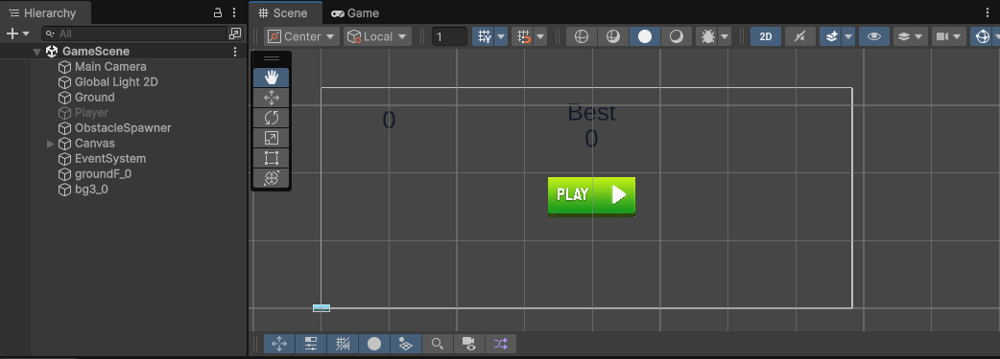
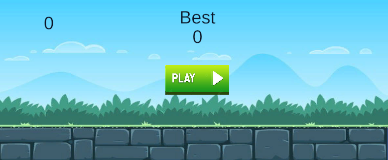
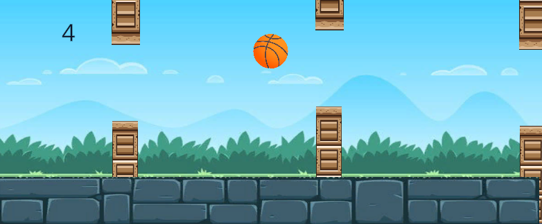
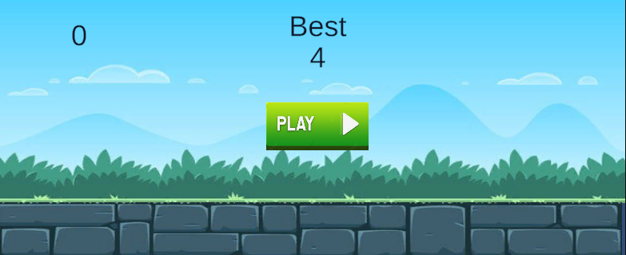

# SkyBound 🎮

[](https://unity.com/)
[](LICENSE)
[]()
[](https://github.com/anis191/SkyBound/commits/main)

**SkyBound** is an exciting, arcade-style Unity 2D game where players navigate obstacles and aim for the highest score. This project demonstrates clean project structure, modular coding, and smooth gameplay mechanics.

---

## Features

- Smooth 2D gameplay with responsive controls  
- Procedurally generated obstacles  
- Score tracking and high-score system  
- User-friendly UI & animations  
- Optimized for desktop (Windows) builds  
- Easy-to-modify project structure for learning and customization  

---

## Game Screenshots

|  |  |  |  |
|:-----------------------------------------------:|:-----------------------------------------------:|:-----------------------------------------------:|:-----------------------------------------------:|
| *Gameplay view 1*                               | *Gameplay view 2*                               | *Gameplay view 3*                               | *Gameplay view 4*                               |

---

## Project Structure

```

SkyBound/
├── Assets/                # Game assets: sprites, scripts, scenes, prefabs
├── Packages/              # Unity packages
├── ProjectSettings/       # Unity project configuration files
├── SkyBoundBuild/         # Build output (.exe and Data folder)
├── .gitignore             # Files and folders ignored by Git
└── README.md

````

---

## Installation & Running

### Requirements:
- Unity version **2021.x or above**  
- Windows PC (for running .exe)

### Steps to Run:
1. Clone the repository:

```bash
git clone https://github.com/anis191/SkyBound.git
cd SkyBound
````

2. Open the project in **Unity Hub**.
3. Open the **GameScene** from `Assets/Scenes/`.
4. Press the **Play** button in Unity Editor to run.
5. OR run the build directly:

```bash
SkyBoundBuild/SkyBound.exe
```

---

## Build Size

* Project size (after ignoring Library & temporary files): ~107 MB
* Build folder size (`SkyBoundBuild/`): ~98 MB
* Optimized to exclude unnecessary Unity cache files

---

## Scripts Overview

* `PlayerController.cs` – Player movement and controls
* `ObstacleHandler.cs` – Obstacle behavior & collision detection
* `ObstacleSpawner.cs` – Procedural spawning of obstacles
* `UserInterfaceHandelar.cs` – UI updates, score display

*(Check `Assets/Scripts/` for full code)*

---

## GitHub Notes

* `.gitignore` excludes `Library/`, `Temp/`, `.vs/` and other Unity cache files
* Build folder `SkyBoundBuild/` is included in repo for demo purposes
---

## Future Improvements

* Mobile (Android/iOS) support
* Power-ups & collectibles
* Leaderboard system (online high scores)
* Sound & music enhancements
* More levels & dynamic difficulty

---

## License

This project is **MIT Licensed** – see the [LICENSE](LICENSE) file for details.

---

## Credits

* **Developed by:** Anisul Alam
* **Built with:** Unity Engine
* **Assets:** Free resources / Custom created

---

## Connect

* [GitHub](https://github.com/anis191)
* [LinkedIn](https://www.linkedin.com/in/anisul-alam-a330042a9/)

---

> Made with ❤️ and Unity
